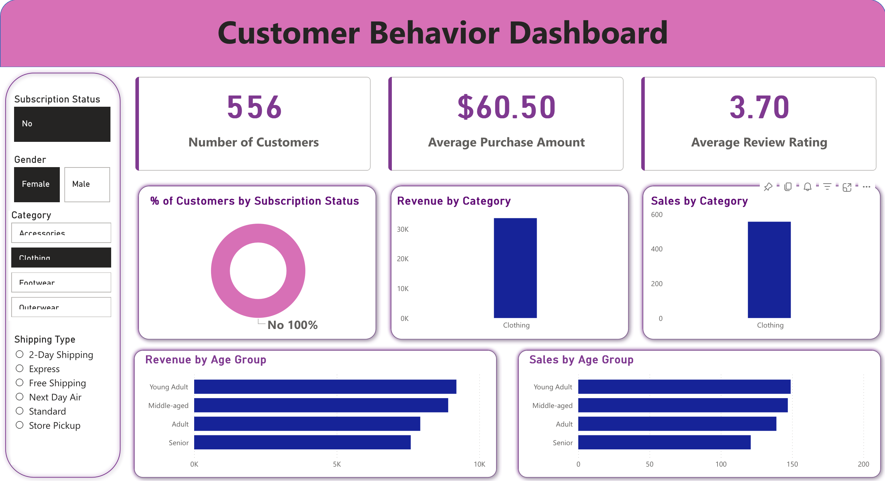

# 👨🏻‍💻 Customer Shopping Behavior Analysis


A complete, industry-standard, end-to-end data analytics project that simulates real-world business intelligence workflows — from raw data to actionable insights.

---

## 📌 Project Overview

A leading retail company wants to better understand its customers' shopping behavior in order to improve sales, customer satisfaction, and long-term loyalty. This project analyzes consumer behavior data to answer the following business question:

> *"How can the company leverage consumer shopping data to identify trends, improve customer engagement, and optimize marketing and product strategies?"*

---

## 🗂️ Project Structure
```
Customer-Shopping-Behavior-Analysis/
│
├── 📓 Data.ipynb                                  # Data preparation & EDA
├── 🗄️  customer_behavior_sql_queries.sql           # SQL business queries
├── 📊 customer_behavior_dashboard.pbix            # Power BI dashboard
├── 📄 Business_Problem_Document.pdf               # Project brief
├── 📽️  Customer-Shopping-Behavior-Analysis.pptx   # Presentation deck
└── 📖 README.md                                   # Project documentation
```

---

## 🛠️ Tech Stack

| Tool | Purpose |
|------|---------|
| Python (Pandas) | Data Preparation & EDA |
| PostgreSQL | Database & SQL Analysis |
| Power BI | Dashboard & Visualization |
| Gamma AI | Presentation |
| GitHub | Version Control |

---

## 📊 Dataset

The dataset contains **3,900 customer records** with 18 features including:

- Customer demographics (Age, Gender, Location)
- Purchase details (Amount, Category, Item, Season)
- Behavioral data (Subscription Status, Frequency, Payment Method)
- Feedback (Review Rating, Discount Applied, Shipping Type)

---

## ✅ Project Workflow

### 1. 🐍 Data Preparation & EDA (Python)
- Imported and explored the raw dataset
- Handled **37 missing values** in Review Rating using category-wise median imputation
- Standardized column names to lowercase with underscores
- Created new feature: **Age Group** (Young Adult, Adult, Middle-aged, Senior)
- Mapped purchase frequency to numeric days (`purchase_frequency_days`)
- Detected and dropped redundant column (`promo_code_used` = `discount_applied`)
- Loaded cleaned data into PostgreSQL database

### 2. 🗄️ Data Analysis (SQL)
- Organized data into structured PostgreSQL database
- Ran queries to extract insights on:
  - Customer segments and demographics
  - Loyalty and subscription behavior
  - Purchase drivers (discounts, seasons, payment methods)
  - Revenue by category and age group

### 3. 📊 Visualization & Insights (Power BI)
- Built an interactive dashboard with:
  - **KPI Cards:** Total Customers, Avg Purchase Amount, Avg Review Rating
  - **Donut Chart:** Customer split by Subscription Status
  - **Bar Charts:** Revenue & Sales by Category and Age Group
  - **Filters:** Gender, Category, Subscription Status, Shipping Type

### 4. 📝 Report & Presentation
- Written project report summarizing key findings and business recommendations
- Presentation deck built using Gamma AI

---

## 🔍 Key Findings

- **Clothing** is the top performing category by both revenue and sales volume
- **Young Adults** generate the highest revenue across all age groups
- Only **26.31%** of customers are subscribed — a major opportunity for loyalty programs
- **Free Shipping** is the most preferred shipping method among customers
- **PayPal** is the most commonly used payment method

---

## 💡 Business Recommendations

- Launch targeted **subscription campaigns** to convert non-subscribers
- Focus marketing spend on **Young Adult** demographic for maximum ROI
- Offer **Free Shipping** thresholds to increase average order value
- Promote top categories like **Clothing** during peak seasons (Spring)

---

## 📸 Dashboard Preview



---

## 🚀 How to Use This Project

1. **Clone the repository**
```bash
git clone https://github.com/yourusername/Customer-Shopping-Behavior-Analysis.git
```

2. **Open the Python notebook**
```bash
jupyter notebook Data.ipynb
```

3. **Set up PostgreSQL database**
   - Create a database called `customer_behavior`
   - Run the notebook to load cleaned data into PostgreSQL

4. **Run SQL queries**
   - Open `customer_behavior_sql_queries.sql`
   - Run queries in PostgreSQL to extract business insights

5. **Open Power BI Dashboard**
   - Open `customer_behavior_dashboard.pbix` in Power BI Desktop
   - Reconnect to your local PostgreSQL database if needed

---

## 👩‍💻 Author

Made with ❤️ as part of a Data Analytics Portfolio Project
